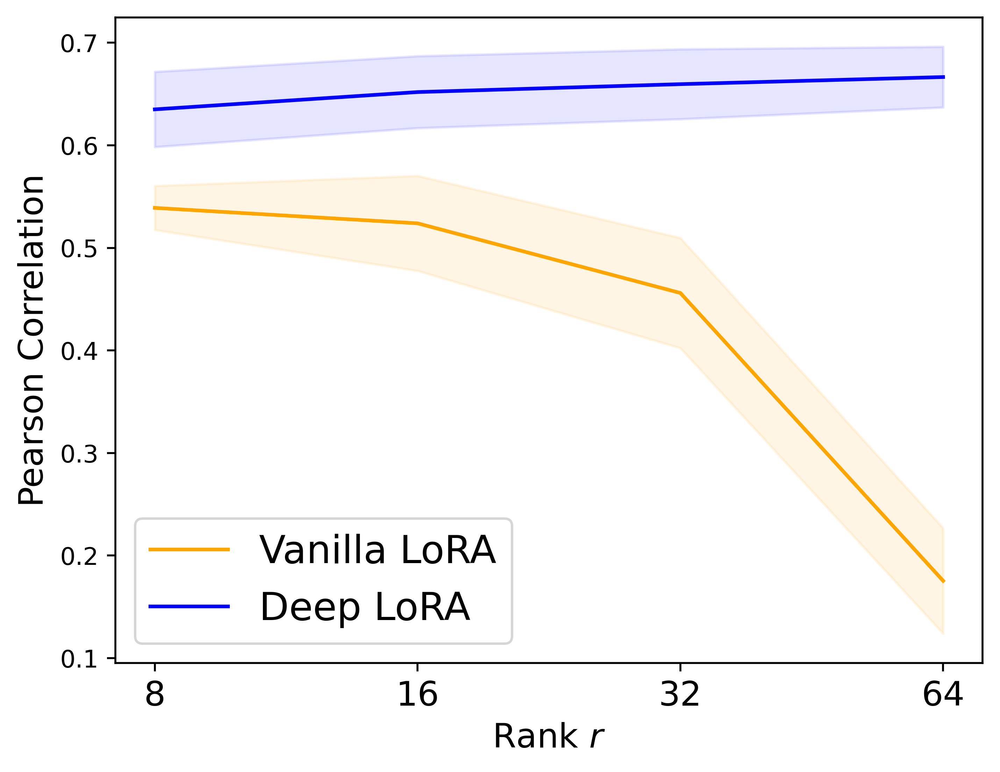

# Deep LoRA
Implementation of Deep LoRA in JAX/Flax. 

Deep LoRA is based on a three-layer _overparameterized_ low-rank factorization that is compressed to have similar overhead to original LoRA, while enjoying

- better few-shot fine-tuning generalization
- parsimonious (lower-rank) updates
- robust rank hyperparameter tuning

<p float="left">
  
   
  
</p>

See the [paper](https://arxiv.org/abs/2406.04112) for more details.

This repo has been made publicly available for reproducibility, but **still under construction.** Will release PyTorch version, improve interface/implementation, and add new features (hopefully) in the next couple months. 😊


## Setup
1. Create and activate virtual environment
```
python -m venv .venv
source .venv/bin/activate
```
2. Install `dlt` as a local package
```
pip install -e .
```

## Experiments
All experiments from the paper can be found in the `scripts` folder. For example, to generate Figure 2 from the paper, simply run `python scripts/intro.py`.

- To add a new model, extend the enum in `configs.py` and add LoRA parameter paths to `model_utils.py`. 
- To add a new dataset, extend the enums in `configs.py` and create a new load function in `data.py` (may also need to add a metric to `metrics.py`).

## Known Issues
- Setting `lora_compress=True` can cause OOM if the overparameterized LoRA is too large before compression. Set `lora_compress=False` in such cases. 
